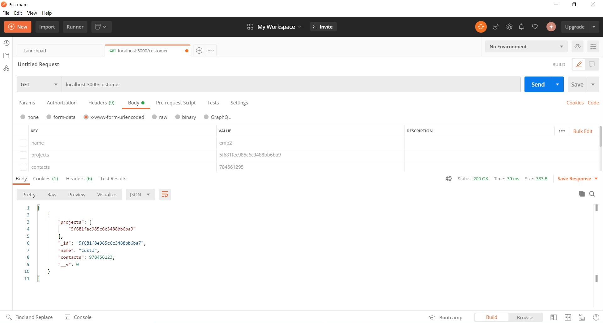

# Project Management System
Tasks for Unicode learning period

## Project Structure

```
.
├── .gitignore              -> Git ignore file for node_modules and vscode configs
├── config/                 -> Contains passport queries
├── controllers/            -> Contains functions related to each route
├── models/                 -> Contains DB models
├── public/uploads/         -> Contains file upload and handing using multer
├── router/                 -> Files exporting respective routers for each endpoint)
├── screenshot/             -> Contains screenshots for readme
├── test/                   -> Contains testing for routes
├── views/                  -> Contains GUI files
├── app.js                  -> Connects to DB, Sets up express app with routers, middlewares etc and exports it
└── package.json            -> Npm package.json file
```
## Usage
```
node app.js
```
## Endpoints
All root endpoints have their separate router in `./controllers` folder

|Endpoints                    |Description                                                                      |Methods               |
|-----------------------------|---------------------------------------------------------------------------------|----------------------|
|/                            |Index page                                                                       |GET                   |
|/signIn                      |Sign In page                                                                     |POST                  |
|/signUp                      |Sign Up page                                                                     |GET, POST             |
|/signOut                     |Sign Out page                                                                    |POST                  |
|/employee                    |List of all emplloyees                                                           |GET, POST             |
|/employee/:employeeId        |Details of specified employee                                                    |GET, PUT, DELETE      |
|/project                     |List of all projects                                                             |GET, POST             |
|/project/:projectId          |Details of specified project                                                     |GET, PUT, DELETE      |
|/customer                    |List of all customers                                                            |GET, POST             |
|/customer/:customerId        |Details of specified customer                                                    |GET, PUT, DELETE      |
|/employee/:employeeId/upload |Uploading resume of employee                                                     |GET, POST             |
|/getResume                   |Resume of particular employee                                                    |GET, POST             |

The get request on the sign up page is basically to check if the user is authenticated or not. All the routes pertaining to the employees, projects and customers require authentication.

## Testing

Index Page


Sign Up


Sign In


When logged as an admin

The admin has a right to access any route.





When logged in as employee

The employee has restricted access to most routes. Employee have only access to get or put route to his particular route and to get the particular project he is in.


When logged in as customer

The customer also has certain restricted access. Customers are only granted access to this particular route, the project route he has given and the particular employees working for that project


Sign Out


